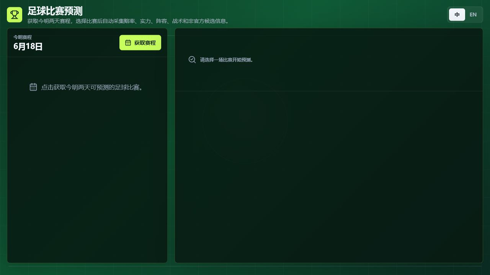
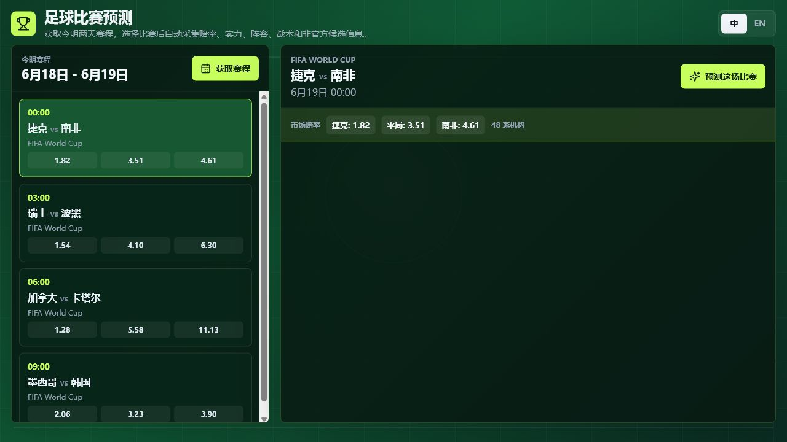
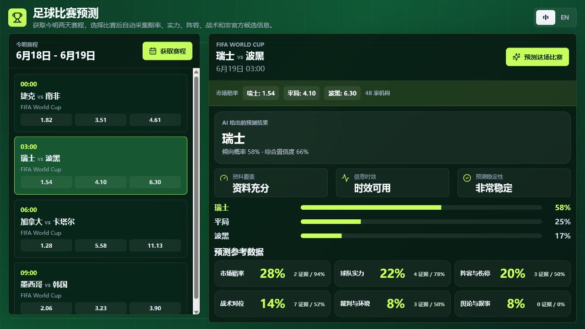

# PitchSignals

> A transparent, evidence-driven football pre-match prediction research tool.

[中文 README](./README.md)

PitchSignals is a local football prediction app for research. It fetches fixtures and 1X2 odds, collects public signals, and estimates win/draw/loss probabilities, confidence, and factor weights.

## Positioning

PitchSignals is built around one idea:

> Do not hide uncertainty. Do not exaggerate predictive power. Make football prediction auditable, reviewable, and gradually improvable.

PitchSignals is not a betting platform, betting-tips tool, or commercial prediction API. It is a research project for studying football prediction workflows, data quality, factor weights, and model calibration.

## Interface Preview

When the app opens, users start from a simple fixture entry point.



After clicking `获取赛程`, the app shows upcoming fixtures and 1X2 odds.



After selecting a match and running prediction, the app shows win/draw/loss probabilities, confidence, and factor weights.



## Acknowledgement

PitchSignals thanks [Agent-Reach](https://github.com/Panniantong/Agent-Reach), whose ideas and tooling inspired the football information search workflow used in this project.

Agent-Reach helps AI agents search and read public web information across multiple platforms. PitchSignals uses this kind of agentic information access to research football news, previews, lineup rumors, tactical discussions, and other public pre-match signals.

## Important Notice

PitchSignals is for research, learning, and model experimentation only.

Do not use this project for:

1. Gambling
2. Betting platforms
3. Sports betting recommendations
4. Automated betting
5. Commercial prediction services
6. Any profit-oriented betting-related workflow

The output is not betting advice, investment advice, or commercial decision advice. Football is highly uncertain, and every prediction can be wrong.

License: this project uses a non-commercial license. See [LICENSE](./LICENSE).

## Features

PitchSignals currently supports:

1. Fetching today and tomorrow's football fixtures
2. Fetching 1X2 pre-match market data
3. Converting odds into market-implied probabilities
4. Collecting signals about team strength, lineup/injury, tactics, referee/environment, and public narrative
5. Using an LLM to structure noisy public text into low-confidence structured signals
6. Producing win/draw/loss probabilities through a football weighting model
7. Displaying pick, confidence, and factor weights
8. Keeping previous predictions when switching between matches
9. Chinese/English UI, including translated country names in Chinese mode
10. Optional Zhihu Open Platform search for Chinese-language context

## Requirements

Minimum:

1. Python 3.11+
2. Node.js 18+
3. An OpenAI-compatible LLM API key
4. A free The Odds API key
5. Optional: Zhihu Open Platform Access Secret for Chinese search enrichment

The Odds API website: [https://the-odds-api.com/](https://the-odds-api.com/)

Zhihu Open Platform docs: [https://developer.zhihu.com/docs?key=authorization](https://developer.zhihu.com/docs?key=authorization)

LLM integration:

PitchSignals uses OpenAI-compatible Chat Completions by default. If your model provider exposes a `/v1/chat/completions` compatible endpoint, it can usually be connected with:

```env
LLM_BASE_URL=https://your-openai-compatible-base-url/v1
LLM_MODEL=your-model-name
LLM_API_KEY=your-llm-api-key
```

This commonly works with OpenAI, OpenRouter, DeepSeek, Mimo, Together, SiliconFlow, and other OpenAI-compatible providers. If a provider only exposes native Anthropic or another non-OpenAI protocol, use a compatible proxy or gateway first.

Backend `.env` example:

```env
LLM_ENABLED=true
LLM_PROVIDER=openai_compatible
LLM_BASE_URL=https://your-openai-compatible-base-url/v1
LLM_MODEL=your-model-name
LLM_API_KEY=your-llm-api-key

THE_ODDS_API_KEY=your-the-odds-api-key
THE_ODDS_API_REGIONS=us,uk,eu
THE_ODDS_API_SCHEDULE_SPORT_KEYS=soccer_fifa_world_cup,soccer_uefa_champs_league,soccer_epl,soccer_spain_la_liga,soccer_italy_serie_a,soccer_germany_bundesliga,soccer_france_ligue_one,soccer_usa_mls

# Optional: Zhihu Open Platform search enhancement
ZHIHU_SEARCH_ENABLED=false
ZHIHU_ACCESS_SECRET=
ZHIHU_SEARCH_MODE=zhihu
ZHIHU_SEARCH_MAX_QUERIES=4
ZHIHU_SEARCH_RESULTS_PER_QUERY=3
```

## Agent Quick Deploy

If you use Codex, Cursor, Claude Code, OpenHands, or another coding agent, use [AGENT_DEPLOY.md](./AGENT_DEPLOY.md).

Shortest path:

1. Open [AGENT_DEPLOY.md](./AGENT_DEPLOY.md)
2. Replace `YOUR_LLM_API_KEY`, `YOUR_LLM_BASE_URL`, `YOUR_LLM_MODEL`, and `YOUR_THE_ODDS_API_KEY`
3. Send the whole prompt to your agent
4. The agent should install dependencies, create local `.env`, start backend and frontend, and return the local URL

## What If Odds Are Missing?

Odds are a major directional signal because market prices aggregate a lot of public and semi-public information.

If The Odds API is unavailable:

1. The fixture page may not show matches.
2. The market-odds factor becomes missing.
3. Prediction stability decreases.
4. The model relies more on team strength, public text, lineup, tactics, referee/environment, and narrative signals.
5. Final confidence should be lower.

Missing odds should not destroy the research workflow, but it should make the prediction less stable.

## Quick Start

Backend:

```bash
cd backend
python -m venv .venv
.venv\Scripts\activate
pip install -e .
uvicorn app.main:app --host 127.0.0.1 --port 8000
```

Frontend:

```bash
cd frontend
npm install
npm run dev -- --port 5173
```

Open:

```text
http://127.0.0.1:5173
```

## Workflow

1. Click `获取赛程`.
2. Select a match.
3. Click `预测这场比赛`.
4. Review:
   - AI pick
   - win/draw/loss probabilities
   - confidence
   - data coverage, information freshness, prediction stability
   - factor weights

## Architecture

PitchSignals has four core layers:

```text
Data Layer
  -> Prediction Weight Layer
    -> Prediction Layer
      -> Feedback Optimization Layer
```

### 1. Data Layer

The data layer collects, verifies, filters, and structures football information.

It currently covers:

1. Fixtures
2. 1X2 odds
3. Market-implied probabilities
4. World Football Elo / team strength
5. Lineup and injuries
6. Predicted XI and availability
7. Tactical matchup
8. Referee and environment
9. Weather, venue, and timing context
10. News, previews, and unofficial information
11. Public narrative and sentiment

It tries to separate official data, semi-official data, media reports, predictions, and unofficial rumors.

Unofficial information is not allowed to dominate the model. It is converted by the LLM into low-confidence structured signals first.

Optional enhancement: if a valid Zhihu Open Platform Access Secret is configured, the data layer also queries Zhihu search endpoints for Chinese-language context. If it is not configured or the API is unavailable, the app falls back to the default public search path.

### 2. Prediction Weight Layer

The weight layer determines how much each factor influences the prediction.

The current weighting model is based on long-term football match records, historical results, odds data, and backtesting experiments. It is not intended as a hand-written guess, but as a calibratable framework trained and adjusted from historical matches.

Main factors:

1. Market odds
2. Team strength
3. Lineup and injuries
4. Tactical matchup
5. Referee and environment
6. Public narrative

When a factor is missing, the system should lower that factor's confidence and lower final confidence.

### 3. Prediction Layer

The prediction layer combines:

1. Structured data
2. Market odds
3. Factor weights
4. Factor confidence
5. Model agreement

It outputs:

1. Win/draw/loss probabilities
2. Final lean
3. Confidence
4. Factor-weight summary

The LLM does not directly decide final probabilities. It is used for structuring noisy information and reviewing evidence quality.

### 4. Feedback Optimization Layer

After a match ends, the real result can be fed back into the system.

The feedback layer is designed to:

1. Record prediction correctness
2. Compare predicted probabilities against the result
3. Identify which factor failed
4. Adjust future weights
5. Improve calibration over time

Long term, feedback should produce evaluation reports, model leaderboards, and versioned ensemble weights.

## Breadth of the Data Layer

PitchSignals does not only look at odds or team strength.

Football results can be affected by:

1. Long-term team quality
2. Recent form
3. Injuries
4. Predicted lineup
5. Tactical matchup
6. Venue
7. Weather
8. Referee style
9. Schedule density
10. Market movement
11. Media narrative
12. Unofficial information

The value of the project is putting these signals into one explainable framework with weights, confidence, and missing-data states.

## Current Value and Limits

PitchSignals is suitable for:

1. Football prediction research
2. Data collection and feature-engineering experiments
3. Comparing model probabilities with market odds
4. LLM-assisted public information structuring
5. Explainable prediction prototypes

PitchSignals is not suitable for:

1. Betting
2. Automated wagering
3. Commercial prediction APIs
4. High-risk decision systems

## Checks

Backend:

```bash
python -m compileall backend/app
```

Frontend:

```bash
cd frontend
npm run build
```

Health:

```text
GET http://127.0.0.1:8000/health
```

Schedule:

```text
GET http://127.0.0.1:8000/football/schedule/today?days=2
```
